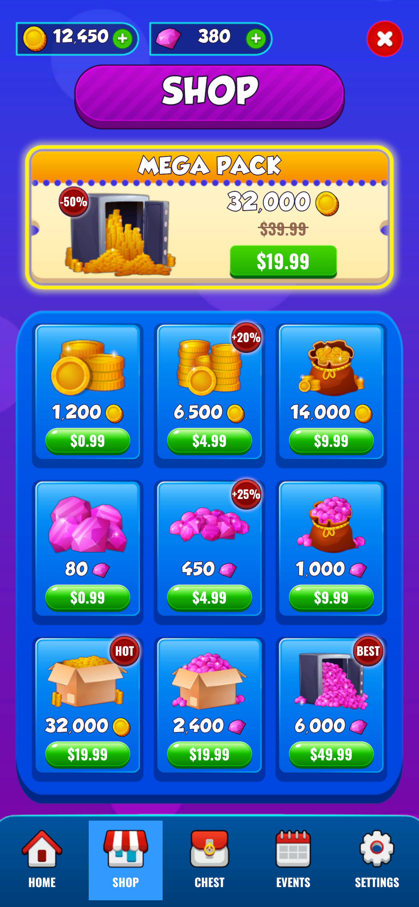
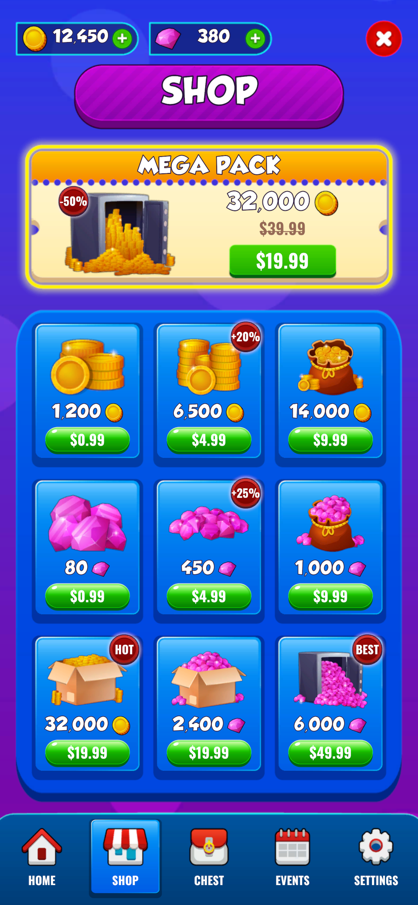
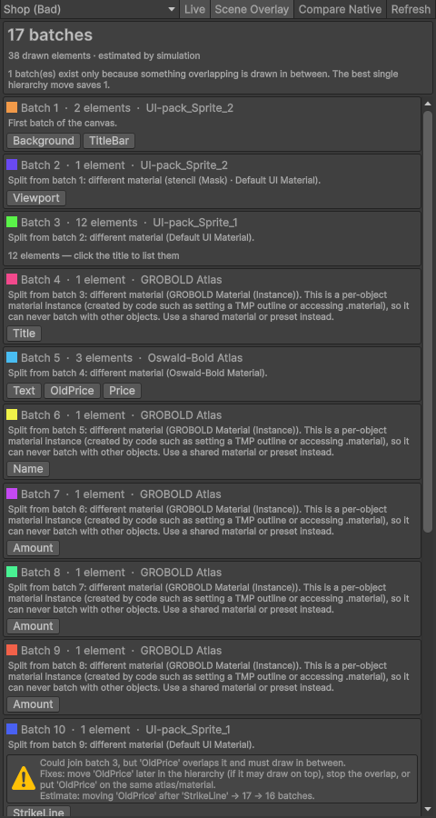
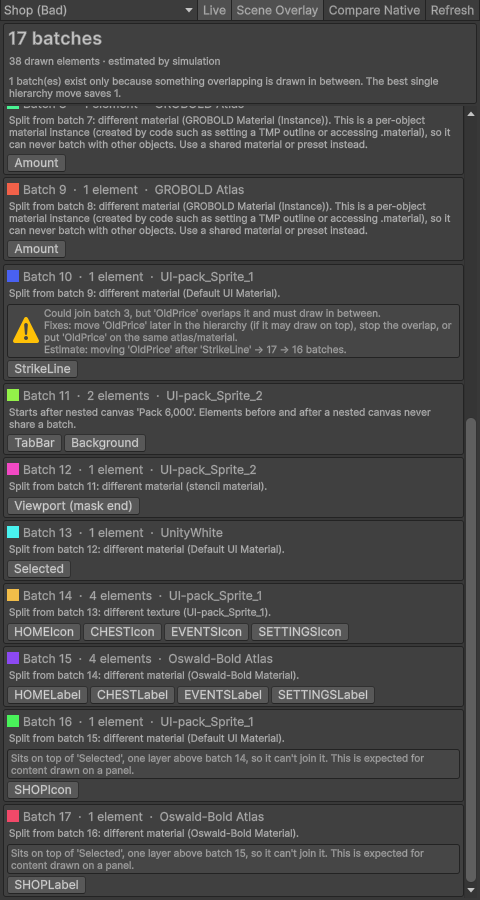
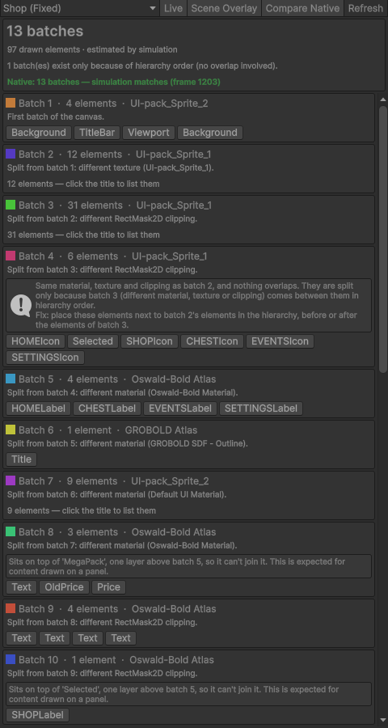

# Canvas Insight

**Explains uGUI draw calls.** For any canvas, Canvas Insight shows how its elements are batched, why each batch break happens, and which element to move to fix it, with an estimate of the result.

> The Profiler tells you a canvas has 17 batches. Canvas Insight tells you that five of them exist because each text got its own material instance, and that another exists only because a strike-through line is drawn as a separate image over the old price.

**Unity 6000.3+ · uGUI 2.0 · TextMeshPro · MIT**

## Same screen, 54 → 13 draw calls

<table>
<tr>
<th>Before: 54 draw calls, 10 canvases</th>
<th>After: 13 draw calls, 1 canvas</th>
</tr>
<tr>
<td></td>
<td></td>
</tr>
</table>

A typical mobile shop screen, built twice. Both versions look the same. The first one has five common mistakes, and Canvas Insight points at each of them:

| Mistake | Fix | What Canvas Insight shows |
|---|---|---|
| A `Canvas` on every pack card | One canvas for the screen | *Starts after nested canvas 'Pack …'*, plus a separate breakdown per card |
| Stencil `Mask` on a rectangular scroll view | `RectMask2D` | *Different material (stencil (Mask) · …)* and an extra *mask end* batch |
| TMP outline set from code | A shared outline material preset | One batch per text: *per-object material instance, use a shared material or preset* |
| Old price crossed out with an `Image` line | TMP's `<s>` tag | *Could join batch 3, but 'OldPrice' overlaps it*, with the batch count after the move |
| Sprite-less tab highlight | A sprite from the same sheet | A batch with *UnityWhite* instead of the sprite sheet |

Counts are from the Profiler's native batch data. The simulation matches both exactly.

## What it looks like

<table>
<tr>
<td width="50%"></td>
<td width="50%"></td>
</tr>
<tr>
<td><b>Every batch and why it split.</b> Five texts each got their own material instance from a code-set outline.</td>
<td><b>Interleaving, nested canvases, masks.</b> The strike line could join the sprite-sheet batch, but <code>OldPrice</code> draws in between. Panels that content simply sits on are recognised as expected.</td>
</tr>
<tr>
<td></td>
<td><b>Compare Native (Play Mode).</b> Checks the simulation against the batches Unity actually built: 13 simulated, 13 native. Also flags batches split only by hierarchy order.</td>
</tr>
</table>

## Install

In Unity, open **Window → Package Manager → + → Install package from git URL…** and paste:

```
https://github.com/berkencami/canvas-insight.git?path=/Packages/com.berkencami.canvas-insight
```

To pin a version, add a tag: `…/com.berkencami.canvas-insight#v0.1.0`.

Then open **Window → Analysis → Canvas Insight** and select any UI object.

This repository is the Unity project the package is developed in. The package itself lives in [`Packages/com.berkencami.canvas-insight`](Packages/com.berkencami.canvas-insight).

## Features (v0.1)

- **Batch breakdown per canvas:** every batch with its elements, texture and material.
- **Break reasons:** different material, different texture, RectMask2D clipping, nested canvas. Per-object material instances and stencil materials are called out.
- **Interleaving detection:** finds batches that could merge with an earlier one and names the element drawn in between (the *blocker*). Panels that content simply sits on are recognised as expected, not flagged.
- **Hierarchy-order splits:** same-material batches that are split only because other elements sort between them.
- **What-if estimate:** re-simulates the canvas with the blocker moved and shows the new batch count.
- **Scene view overlay:** outlines every element in its batch color; click a batch to isolate it.
- **Native comparison (Play Mode):** reads the batches Unity actually built from the Profiler's UI Details data and shows whether the simulation matches.
- **Works in Edit Mode and Prefab Mode,** with no Play Mode needed for the simulation.


## How it works

uGUI batching is native code, so Canvas Insight re-implements the model in plain C#:

1. Walk the canvas in hierarchy order. Nested canvases are skipped, but they split the parent's batching at their position.
2. For each element, take the bounds of the **mesh it actually generates**, not its RectTransform. A wide text box with short text does not block what is under its empty area.
3. Depth = max over earlier overlapping elements of *their depth* (same material, texture and clip) or *their depth + 1* (anything else).
4. Sort by depth, material, texture and hierarchy order, then merge neighbours that share material, texture and clipping.

Things the model accounts for, each checked against native data:

| Behaviour | Detail |
|---|---|
| Mesh bounds, not rects | `OnPopulateMesh` + mesh modifiers, TMP meshes and submeshes |
| Transparent culling | Fully transparent graphics are not batched when `cullTransparentMesh` is on (Unity 6 default) |
| Stencil `Mask` | Adds the mask's closing "unmask" draw after its children |
| `RectMask2D` | Clips children only; different clip rects never share a batch |
| Nested canvas | Elements before and after it never share a batch |
| Z offset / tilt | Does **not** break batching on Overlay canvases |

## Verification

The simulator is a model, not the native implementation, so it is tested against the real thing:

- **Reference scenes:** 15 hierarchies (atlas mixing, interleaving, masks, nested canvases, list rows, TMP presets, inline sprites, wide text). Each expected batch count was verified against native profiler data.
- **Real screen:** both versions of the shop screen above (2 scenes, 11 canvases) match native batch counts exactly.
- **Unit tests:** simulator logic on plain data, with no scene involved.
- **In-editor check:** *Compare Native* shows the real batches next to the simulated ones on your own screens.

When the two disagree, the window says so. Trust the native data.

## Limitations

- Verified on **Screen Space – Overlay** canvases. Camera and World Space canvases are untested (non-coplanar rules likely apply there).
- Sprite atlases resolve to the packed texture only when packing is active in Edit Mode. Use Play Mode or *Compare Native* to be sure.
- Native comparison uses internal editor APIs. If they change in a future Unity version, the tool falls back to simulation only.
- Order within the same depth can differ from native; batch counts match in all reference scenes.

## Roadmap

- **v0.2 Rebuild Tracker:** which canvas rebuilds every frame and which element causes it (text changes, layout, tweens, alpha).
- **v0.3 Overdraw:** heatmap and invisible-but-drawn elements.

## Credits

- Shop screenshots: 2D Game UI Kit by 300Mind. It is not included in this package.
